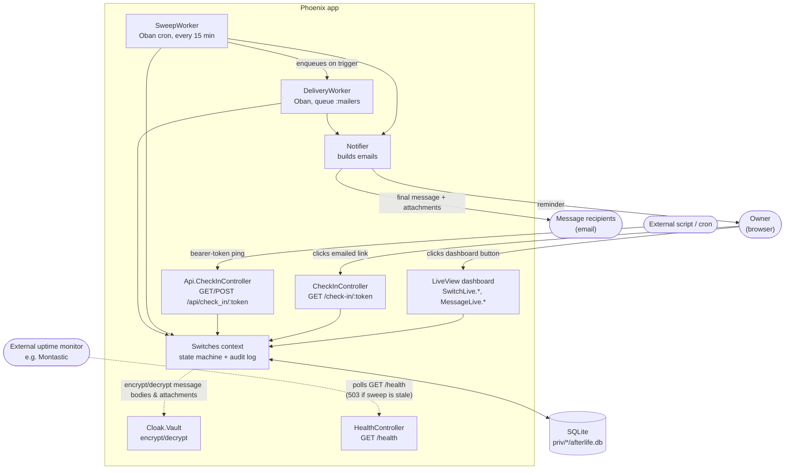
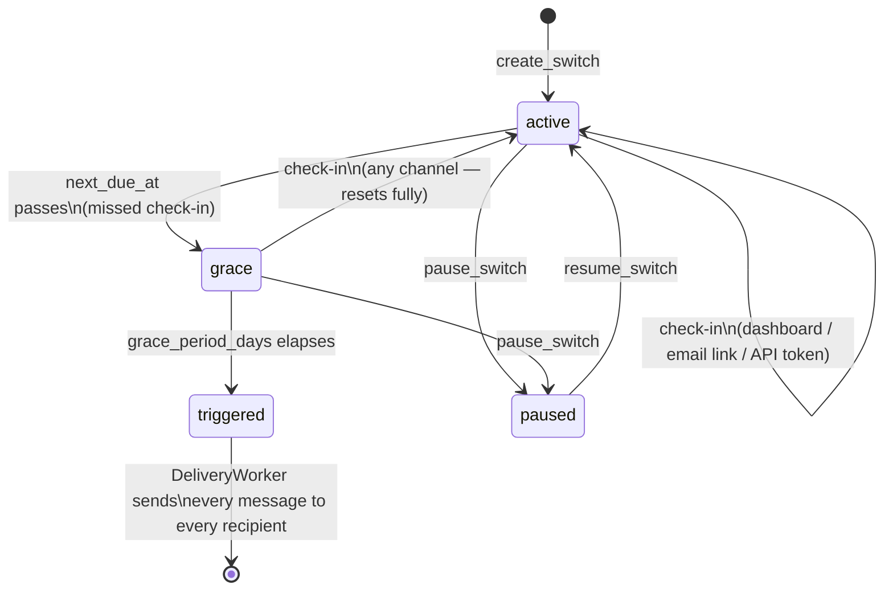
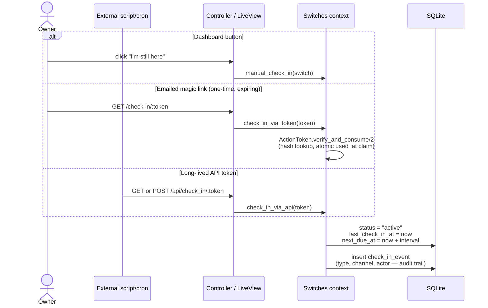
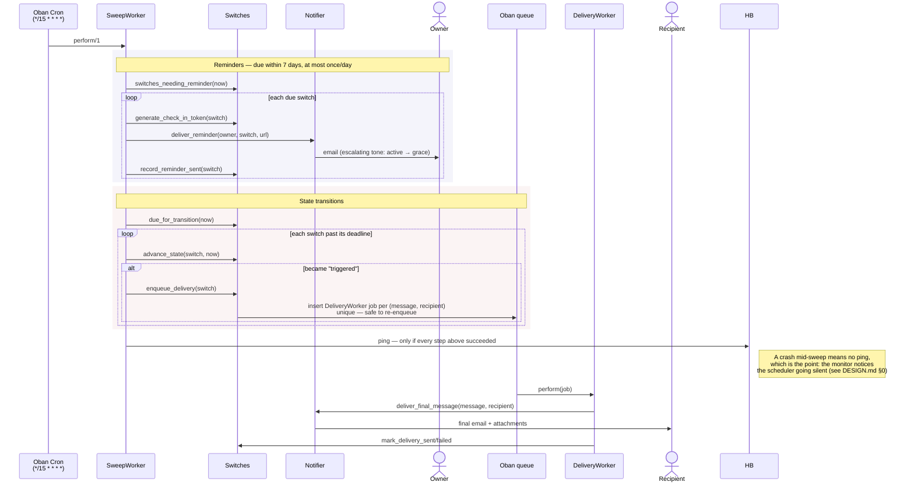
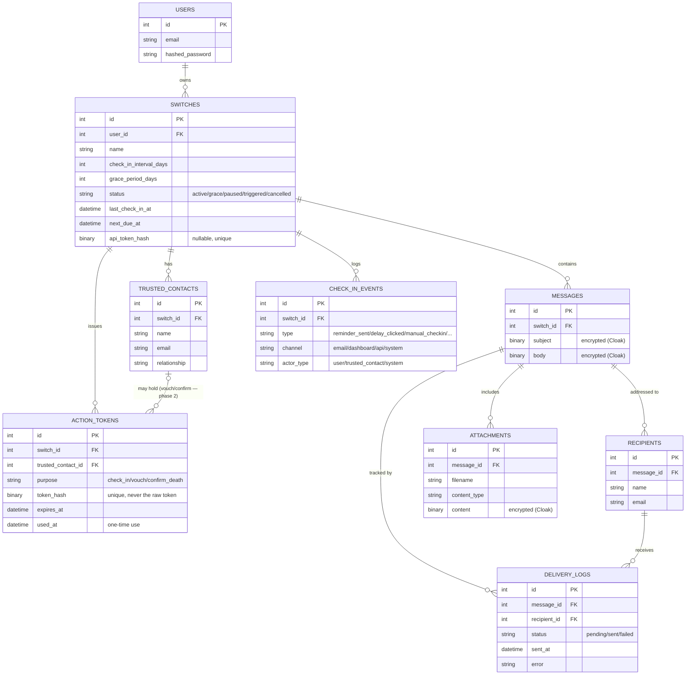

# afterlife — how it works

Companion to [DESIGN.md](DESIGN.md) (rationale/decisions). This doc is
diagrams of the system as built, for orienting in the code.

## 1. Components

The `Switches` context ([`lib/afterlife/switches.ex`](../lib/afterlife/switches.ex))
is the only thing that touches the database for switch-related tables —
every entry point (LiveView, both controllers, both workers) goes
through it rather than querying `Repo` directly.

## 2. The switch state machine

`next_due_at` always means "the next time something happens if nobody
checks in" — recomputed from `last_check_in_at` on every transition
rather than incremented, so it can't drift. See
[`Switches.advance_state/2`](../lib/afterlife/switches.ex) and
[DESIGN.md §4](DESIGN.md#4-check-in--escalation-state-machine).

## 3. Checking in — three channels, one effect

Every path funnels into the same private `check_in/2` — the only
difference between them is which `type`/`channel` gets logged. See
[`lib/afterlife_web/controllers/check_in_controller.ex`](../lib/afterlife_web/controllers/check_in_controller.ex)
and [`.../controllers/api/check_in_controller.ex`](../lib/afterlife_web/controllers/api/check_in_controller.ex).

## 4. The sweep: reminders, triggering, delivery

See [`SweepWorker`](../lib/afterlife/switches/sweep_worker.ex) and
[`DeliveryWorker`](../lib/afterlife/switches/delivery_worker.ex).

## 5. Domain model

`TRUSTED_CONTACTS`/vouch-and-confirm logic is schema-only right now —
Phase 2 per [DESIGN.md](DESIGN.md); everything else in this document is
built, tested, and running.
